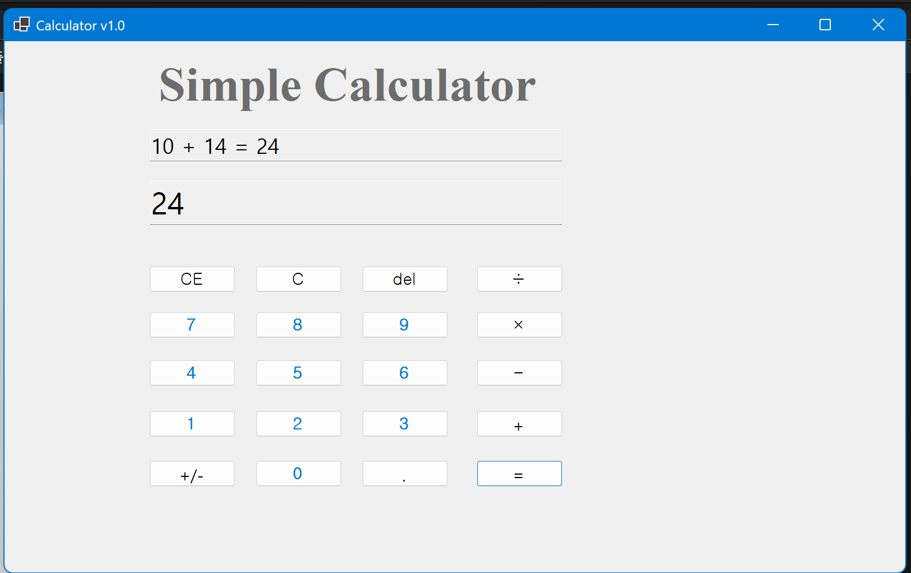
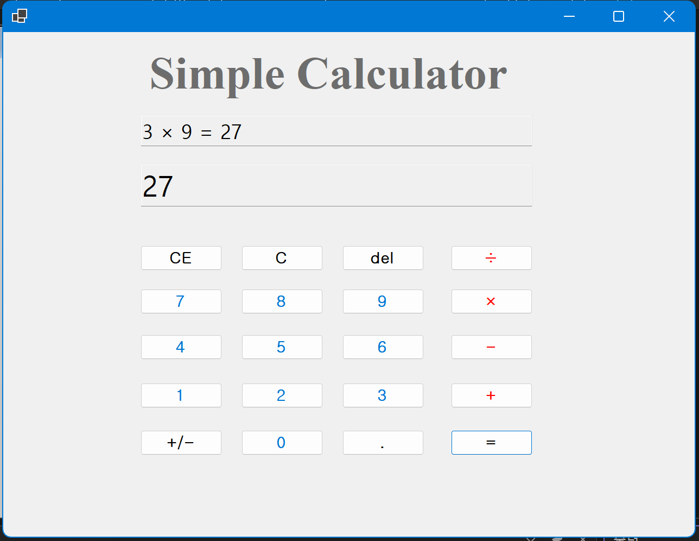
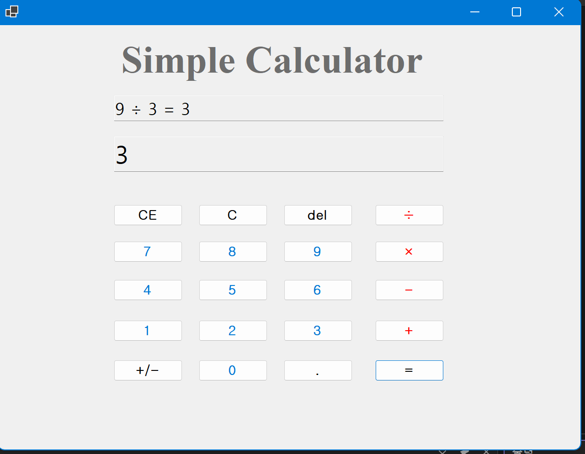
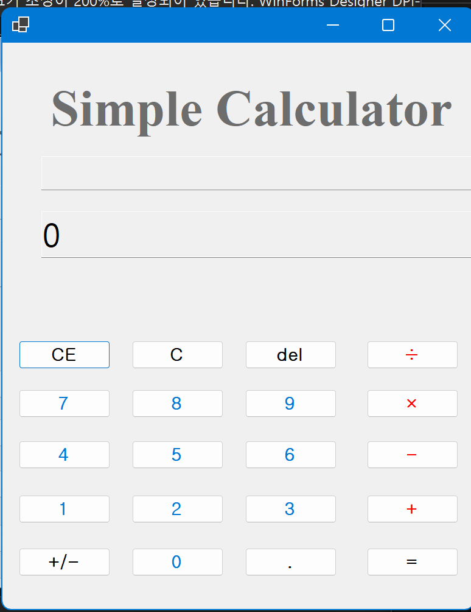
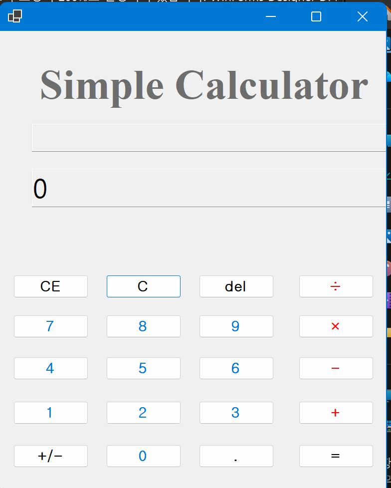
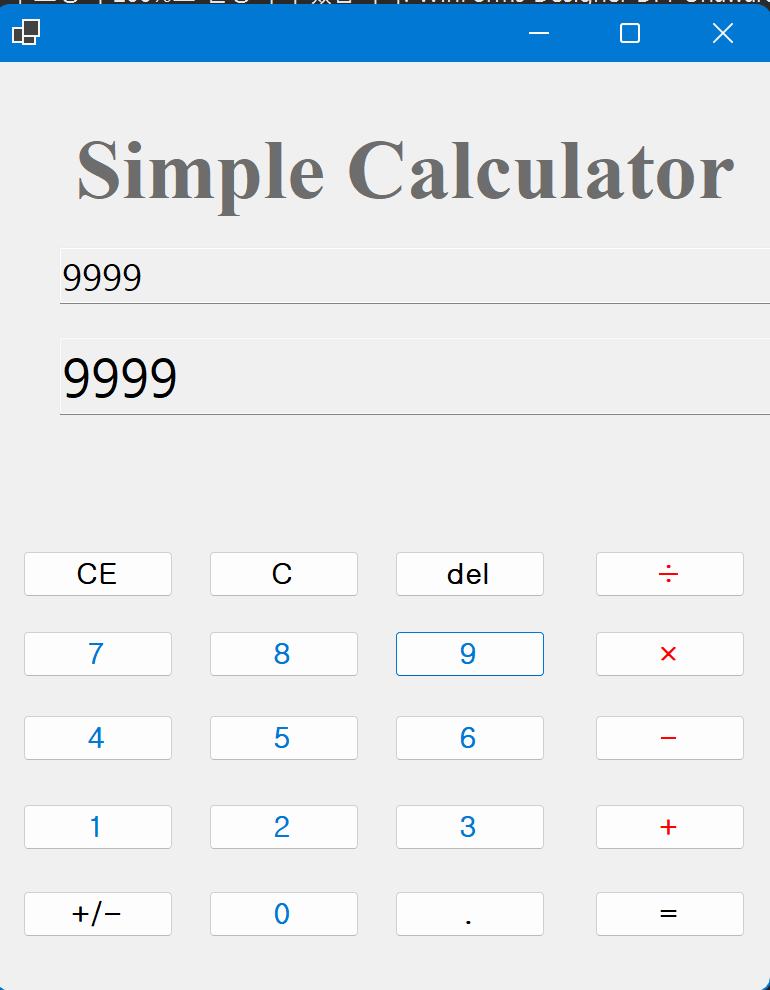
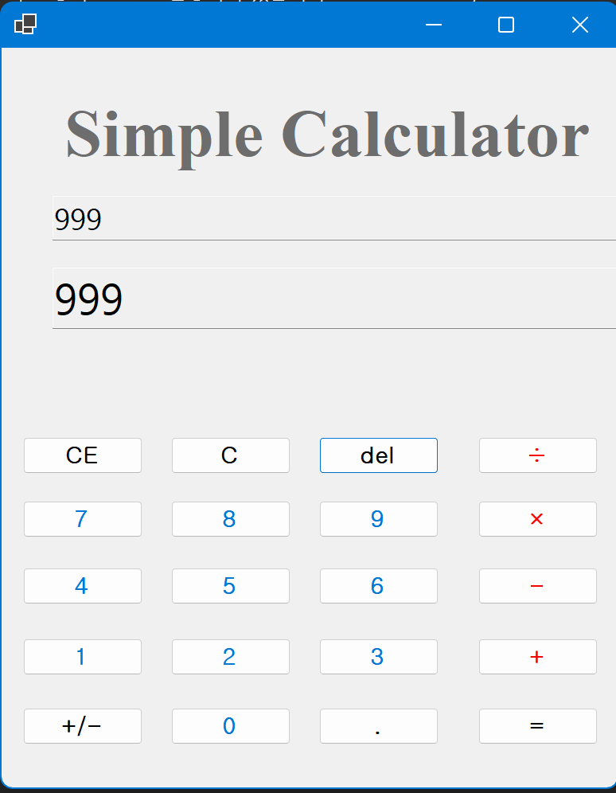
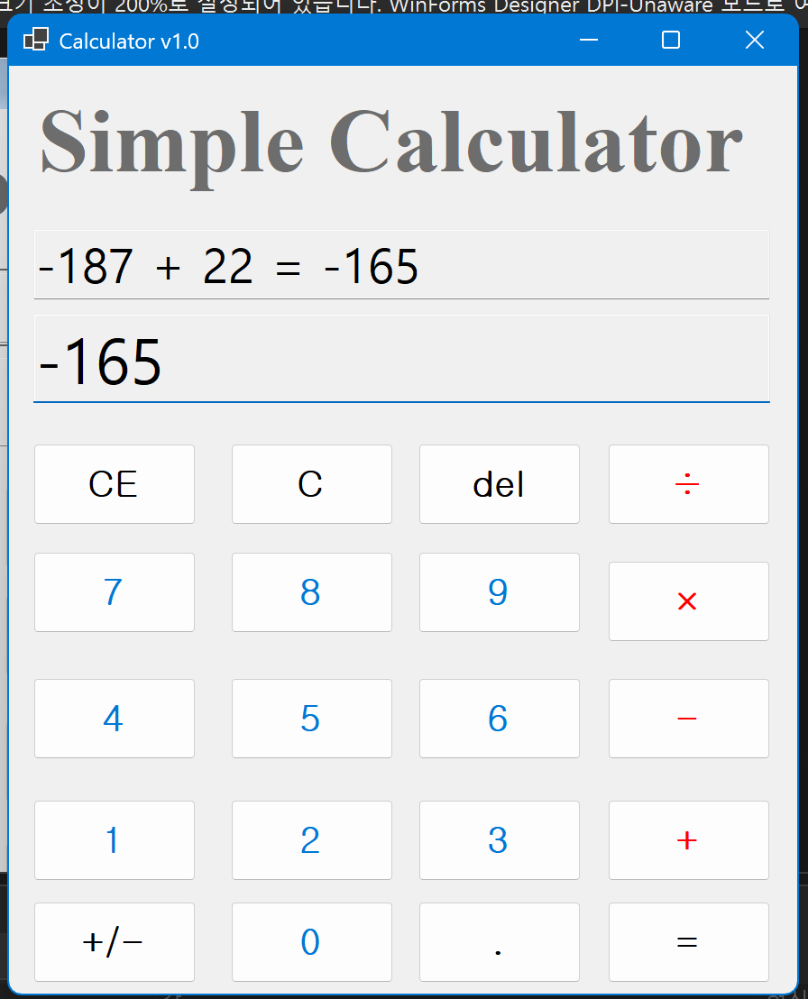
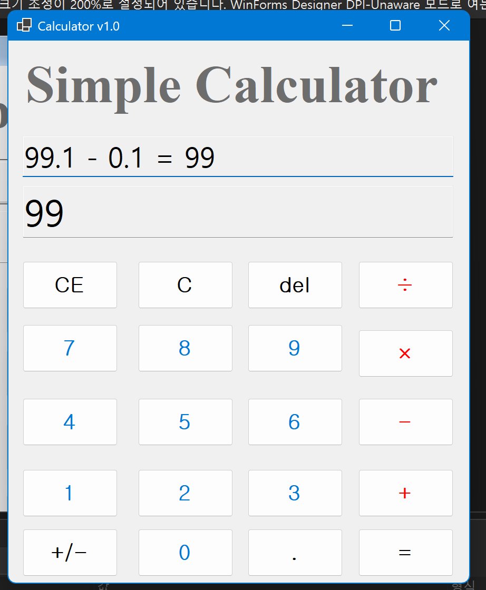

# (C# 코딩) 심플 사칙연산기

## 개요
- C# 프로그래밍 학습을 위해 Windows Forms로 구현한 심플 사칙연산기 프로그램입니다.
- 1줄 소개: 사용자가 버튼과 키보드로 숫자와 연산자를 입력하여 사칙연산을 수행할 수 있는 계산기 프로그램입니다.
- 사용한 플랫폼:
- C#, .NET Windows Forms, Visual Studio, GitHub

- 사용한 컨트롤:
- Label
- TextBox
- Button

- 사용한 기술과 구현한 기능:
- Visual Studio의 Windows Forms 디자이너를 사용하여 계산기 UI를 구성하였습니다.
- TextBox 2개를 사용하여 위쪽에는 전체 식을, 아래쪽에는 현재 입력값과 결과를 표시하도록 구현하였습니다.
- Button 클릭 이벤트를 이용하여 숫자 입력과 연산자 입력이 가능하도록 구현하였습니다.
- 문자열 입력값을 정수 또는 실수로 변환하여 사칙연산이 수행되도록 구현하였습니다.
- 계산 결과를 다시 문자열로 변환하여 화면에 표시하도록 구현하였습니다.
- 공통 메서드를 이용해 숫자 입력, 연산자 처리, 화면 갱신 로직을 정리하였습니다.
- C, CE, Del 버튼 기능을 통해 전체 초기화, 현재 입력값 삭제, 마지막 글자 삭제가 가능하도록 구현하였습니다.
- 곱셈과 나눗셈 버튼은 화면에서 ×, ÷ 기호로 표시되도록 구성하였습니다.
- 소수점 입력 기능을 추가하여 실수 계산이 가능하도록 구현하였습니다.
- +/- 버튼을 눌러 현재 입력 중인 숫자의 부호를 바꿀 수 있도록 구현하였습니다.
- 연산자 입력 직후에도 현재 피연산자가 그대로 표시되도록 수정하여 Windows 계산기와 비슷한 방식으로 동작하도록 개선하였습니다.
- 키보드 입력 기능을 추가하여 숫자, 연산자, Enter, Backspace, Esc 키로 계산기를 조작할 수 있도록 구현하였습니다.

- 핵심 기능:
- 숫자 버튼을 눌러 여러 자리 수를 입력할 수 있습니다.
- 덧셈, 뺄셈, 곱셈, 나눗셈의 사칙연산을 수행할 수 있습니다.
- 계산 중인 전체 식과 현재 입력값 또는 결과를 동시에 확인할 수 있습니다.
- C, CE, Del 버튼으로 입력값과 계산식을 수정할 수 있습니다.
- 소수점 입력과 부호 반전 기능을 사용할 수 있습니다.
- 키보드로도 동일한 계산 기능을 사용할 수 있습니다.

- 화면 구성:
- 상단에는 프로그램 제목을 나타내는 Label을 배치하였습니다.
- 제목 아래 첫 번째 TextBox에는 계산식 전체가 표시되도록 구성하였습니다.
- 두 번째 TextBox에는 현재 입력 중인 숫자나 계산 결과가 표시되도록 구성하였습니다.
- 하단에는 숫자 버튼, 사칙연산 버튼, C/CE/Del 버튼, 부호 반전 버튼, 소수점 버튼, 결과 버튼을 계산기 형태로 배치하였습니다.

## 실행 화면 (과제1)
- 과제1 코드의 실행 스크린샷

- 과제 내용
- 계산기의 기본 UI를 배치하고 TextBox 2개를 사용하여 입력 내용과 결과를 2가지 방식으로 표시하도록 구현하였습니다.
- 숫자 버튼 클릭 시 현재 입력값이 표시되도록 구현하였습니다.
- 더하기 연산과 결과 출력 기능을 구현하였습니다.

- 구현 내용과 기능 설명
- 위쪽 TextBox에는 전체 계산식이 표시되도록 구성하였습니다.
- 아래쪽 TextBox에는 현재 입력 중인 숫자와 최종 결과가 표시되도록 구현하였습니다.
- 숫자 버튼을 여러 번 누르면 여러 자리 수가 순서대로 입력되도록 처리하였습니다.
- 더하기 버튼과 결과 버튼을 눌렀을 때 두 피연산자를 계산하여 결과가 정상적으로 출력되도록 구현하였습니다.

## 실행 화면 (과제2)
- 과제2 코드의 실행 스크린샷

- 과제 내용
- 덧셈 기능만 있던 계산기에 뺄셈, 곱셈, 나눗셈 기능을 추가하였습니다.
- 각 연산 버튼이 공통 계산 흐름을 사용하도록 이벤트를 연결하였습니다.

- 구현 내용과 기능 설명
- 뺄셈, 곱셈, 나눗셈 버튼을 추가하여 사칙연산이 모두 가능하도록 구현하였습니다.
- 곱셈과 나눗셈 버튼은 계산기 형태에 맞게 ×, ÷ 기호로 표시되도록 구성하였습니다.
- 연산자에 따라 계산 방식이 달라지도록 로직을 확장하였습니다.
- 나눗셈 수행 시 결과가 정상적으로 출력되도록 계산 로직을 정리하였습니다.

## 실행 화면 (과제3)
- 과제3 코드의 실행 스크린샷

- 과제 내용
- 계산기의 수정 및 삭제 기능인 C, CE, Del 버튼을 구현하였습니다.
- 계산 중 입력값을 상황에 맞게 초기화하거나 삭제할 수 있도록 기능을 추가하였습니다.

- 구현 내용과 기능 설명
- C 버튼을 누르면 전체 계산 내용이 삭제되고 초기 상태로 돌아가도록 구현하였습니다.
- CE 버튼을 누르면 현재 입력 중인 피연산자 전체가 삭제되도록 구현하였습니다.
- Del 버튼을 누르면 마지막에 입력한 숫자 한 글자만 삭제되도록 구현하였습니다.
- 삭제 동작 후에도 TextBox 화면이 현재 상태에 맞게 즉시 갱신되도록 처리하였습니다.

## 실행 화면 (과제4)
- 과제4 코드의 실행 스크린샷

- 과제 내용
- Windows 계산기를 참고하여 사용자 편의 기능을 추가하였습니다.
- 소수점 입력, 부호 반전, 키보드 입력 기능을 구현하였습니다.
- 연산자 입력 직후 표시 방식도 Windows 계산기와 비슷하게 동작하도록 개선하였습니다.

- 구현 내용과 기능 설명
- . 버튼을 이용하여 소수점이 포함된 실수 입력이 가능하도록 구현하였습니다.
- +/- 버튼을 누르면 현재 입력 중인 숫자의 부호가 바뀌도록 구현하였습니다.
- 숫자 입력 후 연산자를 눌렀을 때 아래쪽 표시창이 0으로 바뀌지 않고 기존 피연산자를 유지하도록 수정하였습니다.
- 숫자키, +, -, *, /, ., Enter, Backspace, Esc 키를 사용하여 키보드로도 계산기를 조작할 수 있도록 구현하였습니다.
- 키보드 입력과 버튼 입력이 같은 로직으로 처리되도록 구성하여 사용 편의성을 높였습니다.

## 배운 내용
- Windows Forms에서 Label, TextBox, Button을 배치하고 속성을 설정하는 방법을 익힐 수 있었습니다.
- 버튼 클릭 이벤트를 이용해 프로그램의 동작을 구현하는 이벤트 기반 프로그래밍 방식을 이해할 수 있었습니다.
- 숫자와 연산자 입력을 문자열로 관리하고, 이를 계산에 맞게 변환하는 과정을 연습할 수 있었습니다.
- 사칙연산 기능을 단계적으로 확장하면서 공통 로직을 분리하는 방법의 중요성을 배웠습니다.
- C, CE, Del 기능을 구현하면서 계산기에서 입력값을 수정하는 방식과 상태 관리의 중요성을 알 수 있었습니다.
- 소수점 입력과 부호 반전 기능을 추가하면서 단순 정수 계산보다 더 다양한 입력 처리가 필요하다는 점을 배웠습니다.
- 키보드 입력 기능을 추가하면서 버튼 입력과 키 입력을 함께 처리하는 방법을 익힐 수 있었습니다.
- 연산자 입력 직후 화면 표시를 수정하는 과정에서 Windows 계산기처럼 자연스러운 사용자 경험을 만드는 것이 중요하다는 점을 알게 되었습니다.
- 프로그램을 단계별로 확장하면서 기능 구현, 디버깅, 예외 상황 처리 능력을 함께 연습할 수 있었습니다.